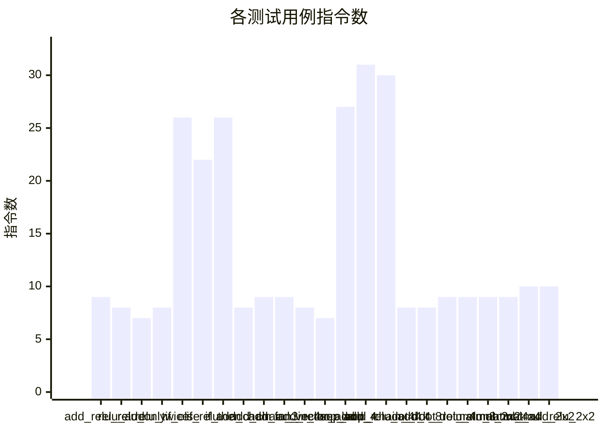

# ScratchV DSL 编译器性能测试报告

## 测试概览

- 生成时间: 2026-06-23 18:20:50
- 用例总数: 23
- 通过数量: 23
- 失败数量: 0
- 通过率: 100.0%
- 测试目录: `tests_main`
- 汇编输出目录: `build`
- 性能基线文件: `reports\benchmark_baseline.json`
- 性能退化阈值: 5.0%

## 测试结果

| 用例 | 类别 | 状态 | 模拟后端 | 平均指令数 | 95%置信区间 | 最小 | 最大 | 基线 | 变化率(%) | 是否退化 | 预期输出 | 实际输出 | 输出匹配 | 汇编文件 |
|---|---|---|---|---:|---:|---:|---:|---:|---:|---|---|---|---|---|
| add_relu_relu | activation | PASS | stub | 9.00 | ±0.00 | 9 | 9 | 9.00 | 0.00 | False | 7 | 7 | True | build\add_relu_relu.s |
| relu_add | activation | PASS | stub | 8.00 | ±0.00 | 8 | 8 | 8.00 | 0.00 | False | 3 | 3 | True | build\relu_add.s |
| relu_only | activation | PASS | stub | 7.00 | ±0.00 | 7 | 7 | 7.00 | 0.00 | False | 0 | 0 | True | build\relu_only.s |
| relu_twice | activation | PASS | stub | 8.00 | ±0.00 | 8 | 8 | 8.00 | 0.00 | False | 4 | 4 | True | build\relu_twice.s |
| if_else | branch | PASS | stub | 26.00 | ±0.00 | 26 | 26 | 26.00 | 0.00 | False | 5 | 5 | True | build\if_else.s |
| if_relu | branch | PASS | stub | 22.00 | ±0.00 | 22 | 22 | 22.00 | 0.00 | False | 0 | 0 | True | build\if_relu.s |
| if_then | branch | PASS | stub | 26.00 | ±0.00 | 26 | 26 | 26.00 | 0.00 | False | 13 | 13 | True | build\if_then.s |
| add_chain | elementwise | PASS | stub | 8.00 | ±0.00 | 8 | 8 | 8.00 | 0.00 | False | 9 | 9 | True | build\add_chain.s |
| add_chain_3 | elementwise | PASS | stub | 9.00 | ±0.00 | 9 | 9 | 9.00 | 0.00 | False | 14 | 14 | True | build\add_chain_3.s |
| add_fan_in_4 | elementwise | PASS | stub | 9.00 | ±0.00 | 9 | 9 | 9.00 | 0.00 | False | 10 | 10 | True | build\add_fan_in_4.s |
| add_reuse | elementwise | PASS | stub | 8.00 | ±0.00 | 8 | 8 | 8.00 | 0.00 | False | 10 | 10 | True | build\add_reuse.s |
| vector_add | elementwise | PASS | stub | 7.00 | ±0.00 | 7 | 7 | 7.00 | 0.00 | False | 5 | 5 | True | build\vector_add.s |
| loop_add_4 | loop | PASS | stub | 27.00 | ±0.00 | 27 | 27 | 27.00 | 0.00 | False | 5 | 5 | True | build\loop_add_4.s |
| loop_add_chain_4 | loop | PASS | stub | 31.00 | ±0.00 | 31 | 31 | 31.00 | 0.00 | False | 9 | 9 | True | build\loop_add_chain_4.s |
| loop_relu_add_4 | loop | PASS | stub | 30.00 | ±0.00 | 30 | 30 | 30.00 | 0.00 | False | 2 | 2 | True | build\loop_relu_add_4.s |
| dot_4 | reduction | PASS | stub | 8.00 | ±0.00 | 8 | 8 | 8.00 | 0.00 | False | 70 | 70 | True | build\dot_4.s |
| dot_8 | reduction | PASS | stub | 8.00 | ±0.00 | 8 | 8 | 8.00 | 0.00 | False | 36 | 36 | True | build\dot_8.s |
| dot_relu_4 | reduction | PASS | stub | 9.00 | ±0.00 | 9 | 9 | 9.00 | 0.00 | False | 0 | 0 | True | build\dot_relu_4.s |
| dot_relu_8 | reduction | PASS | stub | 9.00 | ±0.00 | 9 | 9 | 9.00 | 0.00 | False | 8 | 8 | True | build\dot_relu_8.s |
| matmul_2x2 | tensor | PASS | stub | 9.00 | ±0.00 | 9 | 9 | 9.00 | 0.00 | False | [[19, 22], [43, 50]] | [[19, 22], [43, 50]] | True | build\matmul_2x2.s |
| matmul_4x4 | tensor | PASS | stub | 9.00 | ±0.00 | 9 | 9 | 9.00 | 0.00 | False | [[1, 2, 3, 4], [5, 6, 7, 8], [9, 10, 11, 12], [13, 14, 15, 16]] | [[1, 2, 3, 4], [5, 6, 7, 8], [9, 10, 11, 12], [13, 14, 15, 16]] | True | build\matmul_4x4.s |
| matmul_add_2x2 | tensor | PASS | stub | 10.00 | ±0.00 | 10 | 10 | 10.00 | 0.00 | False | [[20, 23], [44, 51]] | [[20, 23], [44, 51]] | True | build\matmul_add_2x2.s |
| matmul_relu_2x2 | tensor | PASS | stub | 10.00 | ±0.00 | 10 | 10 | 10.00 | 0.00 | False | [[0, 2], [0, 4]] | [[0, 2], [0, 4]] | True | build\matmul_relu_2x2.s |

## 性能图表

### Mermaid 图表

## 用例详情

### add_relu_relu

- 类别: activation
- 描述: Add input and bias, then apply ReLU twice.
- 预期输出 (return_value): 7
- 实际输出: 7
- 输出是否匹配: True
- 模拟后端: stub
- 汇编文件: build\add_relu_relu.s
- Benchmark 重复次数: 3
- 平均指令数: 9.00
- 95% 置信区间: ±0.00
- 最小指令数: 9
- 最大指令数: 9
- 基线指令数: 9.00
- 性能变化率: 0.00%
- 性能退化阈值: 5.00%
- 是否性能退化: False

### relu_add

- 类别: activation
- 描述: Add input and bias, then apply one ReLU.
- 预期输出 (return_value): 3
- 实际输出: 3
- 输出是否匹配: True
- 模拟后端: stub
- 汇编文件: build\relu_add.s
- Benchmark 重复次数: 3
- 平均指令数: 8.00
- 95% 置信区间: ±0.00
- 最小指令数: 8
- 最大指令数: 8
- 基线指令数: 8.00
- 性能变化率: 0.00%
- 性能退化阈值: 5.00%
- 是否性能退化: False

### relu_only

- 类别: activation
- 描述: Apply ReLU directly to a single input value.
- 预期输出 (return_value): 0
- 实际输出: 0
- 输出是否匹配: True
- 模拟后端: stub
- 汇编文件: build\relu_only.s
- Benchmark 重复次数: 3
- 平均指令数: 7.00
- 95% 置信区间: ±0.00
- 最小指令数: 7
- 最大指令数: 7
- 基线指令数: 7.00
- 性能变化率: 0.00%
- 性能退化阈值: 5.00%
- 是否性能退化: False

### relu_twice

- 类别: activation
- 描述: Apply ReLU twice to the same activation path.
- 预期输出 (return_value): 4
- 实际输出: 4
- 输出是否匹配: True
- 模拟后端: stub
- 汇编文件: build\relu_twice.s
- Benchmark 重复次数: 3
- 平均指令数: 8.00
- 95% 置信区间: ±0.00
- 最小指令数: 8
- 最大指令数: 8
- 基线指令数: 8.00
- 性能变化率: 0.00%
- 性能退化阈值: 5.00%
- 是否性能退化: False

### if_else

- 类别: branch
- 描述: if/else branch returns subtraction result when flag is zero.
- 预期输出 (return_value): 5
- 实际输出: 5
- 输出是否匹配: True
- 模拟后端: stub
- 汇编文件: build\if_else.s
- Benchmark 重复次数: 3
- 平均指令数: 26.00
- 95% 置信区间: ±0.00
- 最小指令数: 26
- 最大指令数: 26
- 基线指令数: 26.00
- 性能变化率: 0.00%
- 性能退化阈值: 5.00%
- 是否性能退化: False

### if_relu

- 类别: branch
- 描述: if/else branch combined with add and relu.
- 预期输出 (return_value): 0
- 实际输出: 0
- 输出是否匹配: True
- 模拟后端: stub
- 汇编文件: build\if_relu.s
- Benchmark 重复次数: 3
- 平均指令数: 22.00
- 95% 置信区间: ±0.00
- 最小指令数: 22
- 最大指令数: 22
- 基线指令数: 22.00
- 性能变化率: 0.00%
- 性能退化阈值: 5.00%
- 是否性能退化: False

### if_then

- 类别: branch
- 描述: if/else branch returns add result when flag is non-zero.
- 预期输出 (return_value): 13
- 实际输出: 13
- 输出是否匹配: True
- 模拟后端: stub
- 汇编文件: build\if_then.s
- Benchmark 重复次数: 3
- 平均指令数: 26.00
- 95% 置信区间: ±0.00
- 最小指令数: 26
- 最大指令数: 26
- 基线指令数: 26.00
- 性能变化率: 0.00%
- 性能退化阈值: 5.00%
- 是否性能退化: False

### add_chain

- 类别: elementwise
- 描述: Add a and b, then add c to the intermediate result.
- 预期输出 (return_value): 9
- 实际输出: 9
- 输出是否匹配: True
- 模拟后端: stub
- 汇编文件: build\add_chain.s
- Benchmark 重复次数: 3
- 平均指令数: 8.00
- 95% 置信区间: ±0.00
- 最小指令数: 8
- 最大指令数: 8
- 基线指令数: 8.00
- 性能变化率: 0.00%
- 性能退化阈值: 5.00%
- 是否性能退化: False

### add_chain_3

- 类别: elementwise
- 描述: Chain three add operations across four symbolic inputs.
- 预期输出 (return_value): 14
- 实际输出: 14
- 输出是否匹配: True
- 模拟后端: stub
- 汇编文件: build\add_chain_3.s
- Benchmark 重复次数: 3
- 平均指令数: 9.00
- 95% 置信区间: ±0.00
- 最小指令数: 9
- 最大指令数: 9
- 基线指令数: 9.00
- 性能变化率: 0.00%
- 性能退化阈值: 5.00%
- 是否性能退化: False

### add_fan_in_4

- 类别: elementwise
- 描述: Compute two independent adds and then merge them with a final add.
- 预期输出 (return_value): 10
- 实际输出: 10
- 输出是否匹配: True
- 模拟后端: stub
- 汇编文件: build\add_fan_in_4.s
- Benchmark 重复次数: 3
- 平均指令数: 9.00
- 95% 置信区间: ±0.00
- 最小指令数: 9
- 最大指令数: 9
- 基线指令数: 9.00
- 性能变化率: 0.00%
- 性能退化阈值: 5.00%
- 是否性能退化: False

### add_reuse

- 类别: elementwise
- 描述: Reuse the same intermediate add result on both operands of a second add.
- 预期输出 (return_value): 10
- 实际输出: 10
- 输出是否匹配: True
- 模拟后端: stub
- 汇编文件: build\add_reuse.s
- Benchmark 重复次数: 3
- 平均指令数: 8.00
- 95% 置信区间: ±0.00
- 最小指令数: 8
- 最大指令数: 8
- 基线指令数: 8.00
- 性能变化率: 0.00%
- 性能退化阈值: 5.00%
- 是否性能退化: False

### vector_add

- 类别: elementwise
- 描述: Single add over two symbolic vector inputs.
- 预期输出 (return_value): 5
- 实际输出: 5
- 输出是否匹配: True
- 模拟后端: stub
- 汇编文件: build\vector_add.s
- Benchmark 重复次数: 3
- 平均指令数: 7.00
- 95% 置信区间: ±0.00
- 最小指令数: 7
- 最大指令数: 7
- 基线指令数: 7.00
- 性能变化率: 0.00%
- 性能退化阈值: 5.00%
- 是否性能退化: False

### loop_add_4

- 类别: loop
- 描述: Run a four-iteration loop whose body computes one add; final returned value is the last loop-body result.
- 预期输出 (return_value): 5
- 实际输出: 5
- 输出是否匹配: True
- 模拟后端: stub
- 汇编文件: build\loop_add_4.s
- Benchmark 重复次数: 3
- 平均指令数: 27.00
- 95% 置信区间: ±0.00
- 最小指令数: 27
- 最大指令数: 27
- 基线指令数: 27.00
- 性能变化率: 0.00%
- 性能退化阈值: 5.00%
- 是否性能退化: False

### loop_add_chain_4

- 类别: loop
- 描述: Run a four-iteration loop whose body computes two chained adds; final returned value is the last loop-body result.
- 预期输出 (return_value): 9
- 实际输出: 9
- 输出是否匹配: True
- 模拟后端: stub
- 汇编文件: build\loop_add_chain_4.s
- Benchmark 重复次数: 3
- 平均指令数: 31.00
- 95% 置信区间: ±0.00
- 最小指令数: 31
- 最大指令数: 31
- 基线指令数: 31.00
- 性能变化率: 0.00%
- 性能退化阈值: 5.00%
- 是否性能退化: False

### loop_relu_add_4

- 类别: loop
- 描述: Run a four-iteration loop whose body computes add followed by ReLU; final returned value is the last loop-body result.
- 预期输出 (return_value): 2
- 实际输出: 2
- 输出是否匹配: True
- 模拟后端: stub
- 汇编文件: build\loop_relu_add_4.s
- Benchmark 重复次数: 3
- 平均指令数: 30.00
- 95% 置信区间: ±0.00
- 最小指令数: 30
- 最大指令数: 30
- 基线指令数: 30.00
- 性能变化率: 0.00%
- 性能退化阈值: 5.00%
- 是否性能退化: False

### dot_4

- 类别: reduction
- 描述: Compute the dot product of two symbolic vectors of length 4.
- 预期输出 (return_value): 70
- 实际输出: 70
- 输出是否匹配: True
- 模拟后端: stub
- 汇编文件: build\dot_4.s
- Benchmark 重复次数: 3
- 平均指令数: 8.00
- 95% 置信区间: ±0.00
- 最小指令数: 8
- 最大指令数: 8
- 基线指令数: 8.00
- 性能变化率: 0.00%
- 性能退化阈值: 5.00%
- 是否性能退化: False

### dot_8

- 类别: reduction
- 描述: Compute the dot product of two symbolic vectors of length 8.
- 预期输出 (return_value): 36
- 实际输出: 36
- 输出是否匹配: True
- 模拟后端: stub
- 汇编文件: build\dot_8.s
- Benchmark 重复次数: 3
- 平均指令数: 8.00
- 95% 置信区间: ±0.00
- 最小指令数: 8
- 最大指令数: 8
- 基线指令数: 8.00
- 性能变化率: 0.00%
- 性能退化阈值: 5.00%
- 是否性能退化: False

### dot_relu_4

- 类别: reduction
- 描述: Compute a length-4 dot product and pass it through ReLU.
- 预期输出 (return_value): 0
- 实际输出: 0
- 输出是否匹配: True
- 模拟后端: stub
- 汇编文件: build\dot_relu_4.s
- Benchmark 重复次数: 3
- 平均指令数: 9.00
- 95% 置信区间: ±0.00
- 最小指令数: 9
- 最大指令数: 9
- 基线指令数: 9.00
- 性能变化率: 0.00%
- 性能退化阈值: 5.00%
- 是否性能退化: False

### dot_relu_8

- 类别: reduction
- 描述: Compute a length-8 dot product and pass it through ReLU.
- 预期输出 (return_value): 8
- 实际输出: 8
- 输出是否匹配: True
- 模拟后端: stub
- 汇编文件: build\dot_relu_8.s
- Benchmark 重复次数: 3
- 平均指令数: 9.00
- 95% 置信区间: ±0.00
- 最小指令数: 9
- 最大指令数: 9
- 基线指令数: 9.00
- 性能变化率: 0.00%
- 性能退化阈值: 5.00%
- 是否性能退化: False

### matmul_2x2

- 类别: tensor
- 描述: Compute a symbolic 2x2 by 2x2 matrix multiplication.
- 预期输出 (return_value): [[19, 22], [43, 50]]
- 实际输出: [[19, 22], [43, 50]]
- 输出是否匹配: True
- 模拟后端: stub
- 汇编文件: build\matmul_2x2.s
- Benchmark 重复次数: 3
- 平均指令数: 9.00
- 95% 置信区间: ±0.00
- 最小指令数: 9
- 最大指令数: 9
- 基线指令数: 9.00
- 性能变化率: 0.00%
- 性能退化阈值: 5.00%
- 是否性能退化: False

### matmul_4x4

- 类别: tensor
- 描述: Compute a symbolic 4x4 by 4x4 matrix multiplication.
- 预期输出 (return_value): [[1, 2, 3, 4], [5, 6, 7, 8], [9, 10, 11, 12], [13, 14, 15, 16]]
- 实际输出: [[1, 2, 3, 4], [5, 6, 7, 8], [9, 10, 11, 12], [13, 14, 15, 16]]
- 输出是否匹配: True
- 模拟后端: stub
- 汇编文件: build\matmul_4x4.s
- Benchmark 重复次数: 3
- 平均指令数: 9.00
- 95% 置信区间: ±0.00
- 最小指令数: 9
- 最大指令数: 9
- 基线指令数: 9.00
- 性能变化率: 0.00%
- 性能退化阈值: 5.00%
- 是否性能退化: False

### matmul_add_2x2

- 类别: tensor
- 描述: Compute a 2x2 matmul and then add a symbolic bias term.
- 预期输出 (return_value): [[20, 23], [44, 51]]
- 实际输出: [[20, 23], [44, 51]]
- 输出是否匹配: True
- 模拟后端: stub
- 汇编文件: build\matmul_add_2x2.s
- Benchmark 重复次数: 3
- 平均指令数: 10.00
- 95% 置信区间: ±0.00
- 最小指令数: 10
- 最大指令数: 10
- 基线指令数: 10.00
- 性能变化率: 0.00%
- 性能退化阈值: 5.00%
- 是否性能退化: False

### matmul_relu_2x2

- 类别: tensor
- 描述: Compute a 2x2 matmul and then apply ReLU to its result.
- 预期输出 (return_value): [[0, 2], [0, 4]]
- 实际输出: [[0, 2], [0, 4]]
- 输出是否匹配: True
- 模拟后端: stub
- 汇编文件: build\matmul_relu_2x2.s
- Benchmark 重复次数: 3
- 平均指令数: 10.00
- 95% 置信区间: ±0.00
- 最小指令数: 10
- 最大指令数: 10
- 基线指令数: 10.00
- 性能变化率: 0.00%
- 性能退化阈值: 5.00%
- 是否性能退化: False

