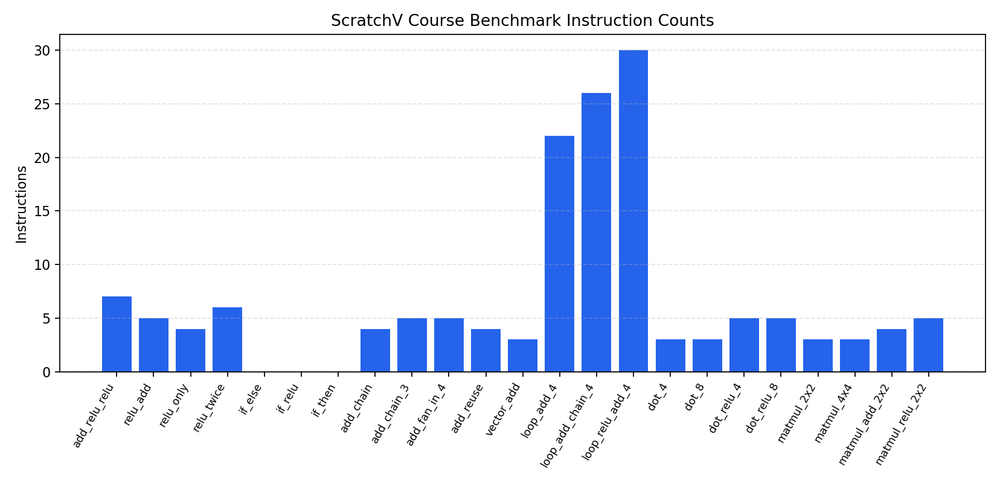
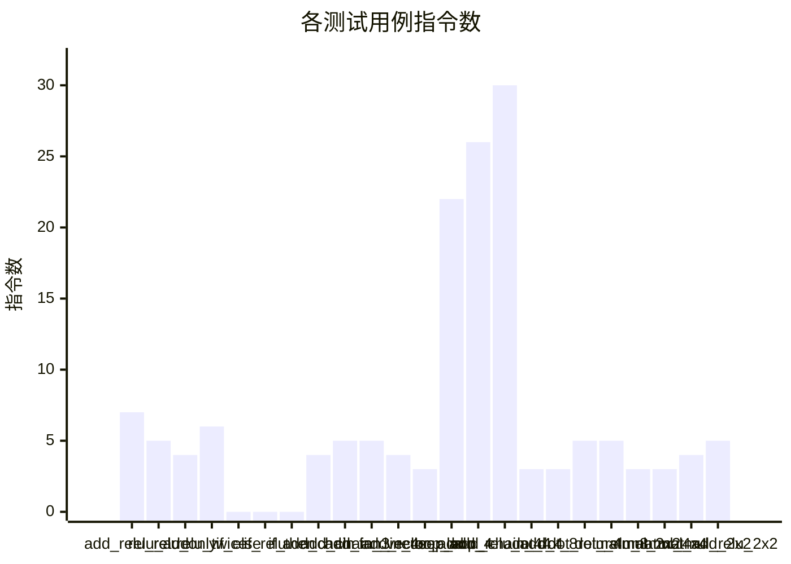

# ScratchV DSL 编译器性能测试报告

## 测试概览

- 生成时间: 2026-07-07 18:48:01
- 用例总数: 23
- 通过数量: 20
- 失败数量: 3
- 通过率: 87.0%
- 测试目录: `D:\PycharmProjects\ScratchV\ScratchV\ScratchV-topic06-deliverable\tests_main`
- 汇编输出目录: `D:\PycharmProjects\ScratchV\ScratchV\ScratchV-topic06-deliverable\build`
- 性能基线文件: `D:\PycharmProjects\ScratchV\ScratchV\ScratchV-topic06-deliverable\reports\benchmark_baseline.json`
- 性能退化阈值: 5.0%
- 单次模拟超时: 5s

## 测试结果

| 用例 | 类别 | 状态 | 模拟后端 | 平均指令数 | 95% 置信区间 | 最小 | 最大 | 编译耗时(s) | 模拟耗时(s) | 总耗时(s) | 基线 | 变化率(%) | 是否退化 | 预期输出 | 实际输出 | 输出匹配 | 汇编文件 |
|---|---|---|---|---:|---:|---:|---:|---:|---:|---:|---:|---:|---|---|---|---|---|
| add_relu_relu | activation | PASS | none | 7.00 | ±0.00 | 7 | 7 | 0.0532 | 0.1323 | 0.4806 | 7.00 | 0.00 | False | 7 | 7 | True | D:\PycharmProjects\ScratchV\ScratchV\ScratchV-topic06-deliverable\build\add_relu_relu.s |
| relu_add | activation | PASS | none | 5.00 | ±0.00 | 5 | 5 | 0.0564 | 0.0981 | 0.4456 | 5.00 | 0.00 | False | 3 | 3 | True | D:\PycharmProjects\ScratchV\ScratchV\ScratchV-topic06-deliverable\build\relu_add.s |
| relu_only | activation | PASS | none | 4.00 | ±0.00 | 4 | 4 | 0.0516 | 0.1000 | 0.4359 | 4.00 | 0.00 | False | 0 | 0 | True | D:\PycharmProjects\ScratchV\ScratchV\ScratchV-topic06-deliverable\build\relu_only.s |
| relu_twice | activation | PASS | none | 6.00 | ±0.00 | 6 | 6 | 0.0533 | 0.0928 | 0.4265 | 6.00 | 0.00 | False | 4 | 4 | True | D:\PycharmProjects\ScratchV\ScratchV\ScratchV-topic06-deliverable\build\relu_twice.s |
| if_else | branch | FAIL | timeout | 0.00 | ±0.00 | 0 | 0 | 0.0512 | 5.0168 | 20.0935 | 0.00 | 0.00 | False | 5 | 5 | True | D:\PycharmProjects\ScratchV\ScratchV\ScratchV-topic06-deliverable\build\if_else.s |
| if_relu | branch | FAIL | timeout | 0.00 | ±0.00 | 0 | 0 | 0.0538 | 5.0090 | 20.1086 | 0.00 | 0.00 | False | 0 | 0 | True | D:\PycharmProjects\ScratchV\ScratchV\ScratchV-topic06-deliverable\build\if_relu.s |
| if_then | branch | FAIL | timeout | 0.00 | ±0.00 | 0 | 0 | 0.0549 | 5.0095 | 20.1093 | 0.00 | 0.00 | False | 13 | 13 | True | D:\PycharmProjects\ScratchV\ScratchV\ScratchV-topic06-deliverable\build\if_then.s |
| add_chain | elementwise | PASS | none | 4.00 | ±0.00 | 4 | 4 | 0.0548 | 0.0969 | 0.4364 | 4.00 | 0.00 | False | 9 | 9 | True | D:\PycharmProjects\ScratchV\ScratchV\ScratchV-topic06-deliverable\build\add_chain.s |
| add_chain_3 | elementwise | PASS | none | 5.00 | ±0.00 | 5 | 5 | 0.0525 | 0.0971 | 0.4357 | 5.00 | 0.00 | False | 14 | 14 | True | D:\PycharmProjects\ScratchV\ScratchV\ScratchV-topic06-deliverable\build\add_chain_3.s |
| add_fan_in_4 | elementwise | PASS | none | 5.00 | ±0.00 | 5 | 5 | 0.0523 | 0.1005 | 0.4393 | 5.00 | 0.00 | False | 10 | 10 | True | D:\PycharmProjects\ScratchV\ScratchV\ScratchV-topic06-deliverable\build\add_fan_in_4.s |
| add_reuse | elementwise | PASS | none | 4.00 | ±0.00 | 4 | 4 | 0.0523 | 0.0935 | 0.4320 | 4.00 | 0.00 | False | 10 | 10 | True | D:\PycharmProjects\ScratchV\ScratchV\ScratchV-topic06-deliverable\build\add_reuse.s |
| vector_add | elementwise | PASS | none | 3.00 | ±0.00 | 3 | 3 | 0.0535 | 0.0945 | 0.4363 | 3.00 | 0.00 | False | 5 | 5 | True | D:\PycharmProjects\ScratchV\ScratchV\ScratchV-topic06-deliverable\build\vector_add.s |
| loop_add_4 | loop | PASS | none | 22.00 | ±0.00 | 22 | 22 | 0.0520 | 0.0941 | 0.4312 | 22.00 | 0.00 | False | 5 | 5 | True | D:\PycharmProjects\ScratchV\ScratchV\ScratchV-topic06-deliverable\build\loop_add_4.s |
| loop_add_chain_4 | loop | PASS | none | 26.00 | ±0.00 | 26 | 26 | 0.0534 | 0.0950 | 0.4375 | 26.00 | 0.00 | False | 9 | 9 | True | D:\PycharmProjects\ScratchV\ScratchV\ScratchV-topic06-deliverable\build\loop_add_chain_4.s |
| loop_relu_add_4 | loop | PASS | none | 30.00 | ±0.00 | 30 | 30 | 0.0511 | 0.0950 | 0.4302 | 30.00 | 0.00 | False | 2 | 2 | True | D:\PycharmProjects\ScratchV\ScratchV\ScratchV-topic06-deliverable\build\loop_relu_add_4.s |
| dot_4 | reduction | PASS | none | 3.00 | ±0.00 | 3 | 3 | 0.0544 | 0.0939 | 0.4362 | 3.00 | 0.00 | False | 70 | 70 | True | D:\PycharmProjects\ScratchV\ScratchV\ScratchV-topic06-deliverable\build\dot_4.s |
| dot_8 | reduction | PASS | none | 3.00 | ±0.00 | 3 | 3 | 0.0537 | 0.1021 | 0.4474 | 3.00 | 0.00 | False | 36 | 36 | True | D:\PycharmProjects\ScratchV\ScratchV\ScratchV-topic06-deliverable\build\dot_8.s |
| dot_relu_4 | reduction | PASS | none | 5.00 | ±0.00 | 5 | 5 | 0.0523 | 0.0954 | 0.4342 | 5.00 | 0.00 | False | 0 | 0 | True | D:\PycharmProjects\ScratchV\ScratchV\ScratchV-topic06-deliverable\build\dot_relu_4.s |
| dot_relu_8 | reduction | PASS | none | 5.00 | ±0.00 | 5 | 5 | 0.0524 | 0.0945 | 0.4350 | 5.00 | 0.00 | False | 8 | 8 | True | D:\PycharmProjects\ScratchV\ScratchV\ScratchV-topic06-deliverable\build\dot_relu_8.s |
| matmul_2x2 | tensor | PASS | none | 3.00 | ±0.00 | 3 | 3 | 0.0518 | 0.0952 | 0.4328 | 3.00 | 0.00 | False | [[19, 22], [43, 50]] | [[19, 22], [43, 50]] | True | D:\PycharmProjects\ScratchV\ScratchV\ScratchV-topic06-deliverable\build\matmul_2x2.s |
| matmul_4x4 | tensor | PASS | none | 3.00 | ±0.00 | 3 | 3 | 0.0529 | 0.0942 | 0.4400 | 3.00 | 0.00 | False | [[1, 2, 3, 4], [5, 6, 7, 8], [9, 10, 11, 12], [13, 14, 15, 16]] | [[1, 2, 3, 4], [5, 6, 7, 8], [9, 10, 11, 12], [13, 14, 15, 16]] | True | D:\PycharmProjects\ScratchV\ScratchV\ScratchV-topic06-deliverable\build\matmul_4x4.s |
| matmul_add_2x2 | tensor | PASS | none | 4.00 | ±0.00 | 4 | 4 | 0.0522 | 0.0940 | 0.4316 | 4.00 | 0.00 | False | [[20, 23], [44, 51]] | [[20, 23], [44, 51]] | True | D:\PycharmProjects\ScratchV\ScratchV\ScratchV-topic06-deliverable\build\matmul_add_2x2.s |
| matmul_relu_2x2 | tensor | PASS | none | 5.00 | ±0.00 | 5 | 5 | 0.0514 | 0.0966 | 0.4342 | 5.00 | 0.00 | False | [[0, 2], [0, 4]] | [[0, 2], [0, 4]] | True | D:\PycharmProjects\ScratchV\ScratchV\ScratchV-topic06-deliverable\build\matmul_relu_2x2.s |

## 性能图表

### Mermaid 图表

## 用例详情

### add_relu_relu

- 类别: activation
- 描述: Add input and bias, then apply ReLU twice.
- 预期输出 (return_value): 7
- 实际输出: 7
- 输出是否匹配: True
- 模拟后端: none
- 编译耗时(s): 0.0532
- 模拟耗时(s): 0.1323
- 参考解释器耗时(s): 0.0001
- 总耗时(s): 0.4806
- 汇编文件: D:\PycharmProjects\ScratchV\ScratchV\ScratchV-topic06-deliverable\build\add_relu_relu.s
- Benchmark 重复次数: 3
- 平均指令数: 7.00
- 95% 置信区间: ±0.00
- 最小指令数: 7
- 最大指令数: 7
- 基线指令数: 7.00
- 性能变化率: 0.00%
- 性能退化阈值: 5.00%
- 是否性能退化: False

### relu_add

- 类别: activation
- 描述: Add input and bias, then apply one ReLU.
- 预期输出 (return_value): 3
- 实际输出: 3
- 输出是否匹配: True
- 模拟后端: none
- 编译耗时(s): 0.0564
- 模拟耗时(s): 0.0981
- 参考解释器耗时(s): 0.0001
- 总耗时(s): 0.4456
- 汇编文件: D:\PycharmProjects\ScratchV\ScratchV\ScratchV-topic06-deliverable\build\relu_add.s
- Benchmark 重复次数: 3
- 平均指令数: 5.00
- 95% 置信区间: ±0.00
- 最小指令数: 5
- 最大指令数: 5
- 基线指令数: 5.00
- 性能变化率: 0.00%
- 性能退化阈值: 5.00%
- 是否性能退化: False

### relu_only

- 类别: activation
- 描述: Apply ReLU directly to a single input value.
- 预期输出 (return_value): 0
- 实际输出: 0
- 输出是否匹配: True
- 模拟后端: none
- 编译耗时(s): 0.0516
- 模拟耗时(s): 0.1000
- 参考解释器耗时(s): 0.0001
- 总耗时(s): 0.4359
- 汇编文件: D:\PycharmProjects\ScratchV\ScratchV\ScratchV-topic06-deliverable\build\relu_only.s
- Benchmark 重复次数: 3
- 平均指令数: 4.00
- 95% 置信区间: ±0.00
- 最小指令数: 4
- 最大指令数: 4
- 基线指令数: 4.00
- 性能变化率: 0.00%
- 性能退化阈值: 5.00%
- 是否性能退化: False

### relu_twice

- 类别: activation
- 描述: Apply ReLU twice to the same activation path.
- 预期输出 (return_value): 4
- 实际输出: 4
- 输出是否匹配: True
- 模拟后端: none
- 编译耗时(s): 0.0533
- 模拟耗时(s): 0.0928
- 参考解释器耗时(s): 0.0001
- 总耗时(s): 0.4265
- 汇编文件: D:\PycharmProjects\ScratchV\ScratchV\ScratchV-topic06-deliverable\build\relu_twice.s
- Benchmark 重复次数: 3
- 平均指令数: 6.00
- 95% 置信区间: ±0.00
- 最小指令数: 6
- 最大指令数: 6
- 基线指令数: 6.00
- 性能变化率: 0.00%
- 性能退化阈值: 5.00%
- 是否性能退化: False

### if_else

- 类别: branch
- 描述: if/else branch returns subtraction result when flag is zero.
- 预期输出 (return_value): 5
- 实际输出: 5
- 输出是否匹配: True
- 模拟后端: timeout
- 编译耗时(s): 0.0512
- 模拟耗时(s): 5.0168
- 参考解释器耗时(s): 0.0001
- 总耗时(s): 20.0935
- 汇编文件: D:\PycharmProjects\ScratchV\ScratchV\ScratchV-topic06-deliverable\build\if_else.s
- Benchmark 重复次数: 3
- 平均指令数: 0.00
- 95% 置信区间: ±0.00
- 最小指令数: 0
- 最大指令数: 0
- 基线指令数: 0.00
- 性能变化率: 0.00%
- 性能退化阈值: 5.00%
- 是否性能退化: False

### if_relu

- 类别: branch
- 描述: if/else branch combined with add and relu.
- 预期输出 (return_value): 0
- 实际输出: 0
- 输出是否匹配: True
- 模拟后端: timeout
- 编译耗时(s): 0.0538
- 模拟耗时(s): 5.0090
- 参考解释器耗时(s): 0.0002
- 总耗时(s): 20.1086
- 汇编文件: D:\PycharmProjects\ScratchV\ScratchV\ScratchV-topic06-deliverable\build\if_relu.s
- Benchmark 重复次数: 3
- 平均指令数: 0.00
- 95% 置信区间: ±0.00
- 最小指令数: 0
- 最大指令数: 0
- 基线指令数: 0.00
- 性能变化率: 0.00%
- 性能退化阈值: 5.00%
- 是否性能退化: False

### if_then

- 类别: branch
- 描述: if/else branch returns add result when flag is non-zero.
- 预期输出 (return_value): 13
- 实际输出: 13
- 输出是否匹配: True
- 模拟后端: timeout
- 编译耗时(s): 0.0549
- 模拟耗时(s): 5.0095
- 参考解释器耗时(s): 0.0002
- 总耗时(s): 20.1093
- 汇编文件: D:\PycharmProjects\ScratchV\ScratchV\ScratchV-topic06-deliverable\build\if_then.s
- Benchmark 重复次数: 3
- 平均指令数: 0.00
- 95% 置信区间: ±0.00
- 最小指令数: 0
- 最大指令数: 0
- 基线指令数: 0.00
- 性能变化率: 0.00%
- 性能退化阈值: 5.00%
- 是否性能退化: False

### add_chain

- 类别: elementwise
- 描述: Add a and b, then add c to the intermediate result.
- 预期输出 (return_value): 9
- 实际输出: 9
- 输出是否匹配: True
- 模拟后端: none
- 编译耗时(s): 0.0548
- 模拟耗时(s): 0.0969
- 参考解释器耗时(s): 0.0001
- 总耗时(s): 0.4364
- 汇编文件: D:\PycharmProjects\ScratchV\ScratchV\ScratchV-topic06-deliverable\build\add_chain.s
- Benchmark 重复次数: 3
- 平均指令数: 4.00
- 95% 置信区间: ±0.00
- 最小指令数: 4
- 最大指令数: 4
- 基线指令数: 4.00
- 性能变化率: 0.00%
- 性能退化阈值: 5.00%
- 是否性能退化: False

### add_chain_3

- 类别: elementwise
- 描述: Chain three add operations across four symbolic inputs.
- 预期输出 (return_value): 14
- 实际输出: 14
- 输出是否匹配: True
- 模拟后端: none
- 编译耗时(s): 0.0525
- 模拟耗时(s): 0.0971
- 参考解释器耗时(s): 0.0002
- 总耗时(s): 0.4357
- 汇编文件: D:\PycharmProjects\ScratchV\ScratchV\ScratchV-topic06-deliverable\build\add_chain_3.s
- Benchmark 重复次数: 3
- 平均指令数: 5.00
- 95% 置信区间: ±0.00
- 最小指令数: 5
- 最大指令数: 5
- 基线指令数: 5.00
- 性能变化率: 0.00%
- 性能退化阈值: 5.00%
- 是否性能退化: False

### add_fan_in_4

- 类别: elementwise
- 描述: Compute two independent adds and then merge them with a final add.
- 预期输出 (return_value): 10
- 实际输出: 10
- 输出是否匹配: True
- 模拟后端: none
- 编译耗时(s): 0.0523
- 模拟耗时(s): 0.1005
- 参考解释器耗时(s): 0.0002
- 总耗时(s): 0.4393
- 汇编文件: D:\PycharmProjects\ScratchV\ScratchV\ScratchV-topic06-deliverable\build\add_fan_in_4.s
- Benchmark 重复次数: 3
- 平均指令数: 5.00
- 95% 置信区间: ±0.00
- 最小指令数: 5
- 最大指令数: 5
- 基线指令数: 5.00
- 性能变化率: 0.00%
- 性能退化阈值: 5.00%
- 是否性能退化: False

### add_reuse

- 类别: elementwise
- 描述: Reuse the same intermediate add result on both operands of a second add.
- 预期输出 (return_value): 10
- 实际输出: 10
- 输出是否匹配: True
- 模拟后端: none
- 编译耗时(s): 0.0523
- 模拟耗时(s): 0.0935
- 参考解释器耗时(s): 0.0001
- 总耗时(s): 0.4320
- 汇编文件: D:\PycharmProjects\ScratchV\ScratchV\ScratchV-topic06-deliverable\build\add_reuse.s
- Benchmark 重复次数: 3
- 平均指令数: 4.00
- 95% 置信区间: ±0.00
- 最小指令数: 4
- 最大指令数: 4
- 基线指令数: 4.00
- 性能变化率: 0.00%
- 性能退化阈值: 5.00%
- 是否性能退化: False

### vector_add

- 类别: elementwise
- 描述: Single add over two symbolic vector inputs.
- 预期输出 (return_value): 5
- 实际输出: 5
- 输出是否匹配: True
- 模拟后端: none
- 编译耗时(s): 0.0535
- 模拟耗时(s): 0.0945
- 参考解释器耗时(s): 0.0001
- 总耗时(s): 0.4363
- 汇编文件: D:\PycharmProjects\ScratchV\ScratchV\ScratchV-topic06-deliverable\build\vector_add.s
- Benchmark 重复次数: 3
- 平均指令数: 3.00
- 95% 置信区间: ±0.00
- 最小指令数: 3
- 最大指令数: 3
- 基线指令数: 3.00
- 性能变化率: 0.00%
- 性能退化阈值: 5.00%
- 是否性能退化: False

### loop_add_4

- 类别: loop
- 描述: Run a four-iteration loop whose body computes one add; final returned value is the last loop-body result.
- 预期输出 (return_value): 5
- 实际输出: 5
- 输出是否匹配: True
- 模拟后端: none
- 编译耗时(s): 0.0520
- 模拟耗时(s): 0.0941
- 参考解释器耗时(s): 0.0002
- 总耗时(s): 0.4312
- 汇编文件: D:\PycharmProjects\ScratchV\ScratchV\ScratchV-topic06-deliverable\build\loop_add_4.s
- Benchmark 重复次数: 3
- 平均指令数: 22.00
- 95% 置信区间: ±0.00
- 最小指令数: 22
- 最大指令数: 22
- 基线指令数: 22.00
- 性能变化率: 0.00%
- 性能退化阈值: 5.00%
- 是否性能退化: False

### loop_add_chain_4

- 类别: loop
- 描述: Run a four-iteration loop whose body computes two chained adds; final returned value is the last loop-body result.
- 预期输出 (return_value): 9
- 实际输出: 9
- 输出是否匹配: True
- 模拟后端: none
- 编译耗时(s): 0.0534
- 模拟耗时(s): 0.0950
- 参考解释器耗时(s): 0.0002
- 总耗时(s): 0.4375
- 汇编文件: D:\PycharmProjects\ScratchV\ScratchV\ScratchV-topic06-deliverable\build\loop_add_chain_4.s
- Benchmark 重复次数: 3
- 平均指令数: 26.00
- 95% 置信区间: ±0.00
- 最小指令数: 26
- 最大指令数: 26
- 基线指令数: 26.00
- 性能变化率: 0.00%
- 性能退化阈值: 5.00%
- 是否性能退化: False

### loop_relu_add_4

- 类别: loop
- 描述: Run a four-iteration loop whose body computes add followed by ReLU; final returned value is the last loop-body result.
- 预期输出 (return_value): 2
- 实际输出: 2
- 输出是否匹配: True
- 模拟后端: none
- 编译耗时(s): 0.0511
- 模拟耗时(s): 0.0950
- 参考解释器耗时(s): 0.0002
- 总耗时(s): 0.4302
- 汇编文件: D:\PycharmProjects\ScratchV\ScratchV\ScratchV-topic06-deliverable\build\loop_relu_add_4.s
- Benchmark 重复次数: 3
- 平均指令数: 30.00
- 95% 置信区间: ±0.00
- 最小指令数: 30
- 最大指令数: 30
- 基线指令数: 30.00
- 性能变化率: 0.00%
- 性能退化阈值: 5.00%
- 是否性能退化: False

### dot_4

- 类别: reduction
- 描述: Compute the dot product of two symbolic vectors of length 4.
- 预期输出 (return_value): 70
- 实际输出: 70
- 输出是否匹配: True
- 模拟后端: none
- 编译耗时(s): 0.0544
- 模拟耗时(s): 0.0939
- 参考解释器耗时(s): 0.0001
- 总耗时(s): 0.4362
- 汇编文件: D:\PycharmProjects\ScratchV\ScratchV\ScratchV-topic06-deliverable\build\dot_4.s
- Benchmark 重复次数: 3
- 平均指令数: 3.00
- 95% 置信区间: ±0.00
- 最小指令数: 3
- 最大指令数: 3
- 基线指令数: 3.00
- 性能变化率: 0.00%
- 性能退化阈值: 5.00%
- 是否性能退化: False

### dot_8

- 类别: reduction
- 描述: Compute the dot product of two symbolic vectors of length 8.
- 预期输出 (return_value): 36
- 实际输出: 36
- 输出是否匹配: True
- 模拟后端: none
- 编译耗时(s): 0.0537
- 模拟耗时(s): 0.1021
- 参考解释器耗时(s): 0.0002
- 总耗时(s): 0.4474
- 汇编文件: D:\PycharmProjects\ScratchV\ScratchV\ScratchV-topic06-deliverable\build\dot_8.s
- Benchmark 重复次数: 3
- 平均指令数: 3.00
- 95% 置信区间: ±0.00
- 最小指令数: 3
- 最大指令数: 3
- 基线指令数: 3.00
- 性能变化率: 0.00%
- 性能退化阈值: 5.00%
- 是否性能退化: False

### dot_relu_4

- 类别: reduction
- 描述: Compute a length-4 dot product and pass it through ReLU.
- 预期输出 (return_value): 0
- 实际输出: 0
- 输出是否匹配: True
- 模拟后端: none
- 编译耗时(s): 0.0523
- 模拟耗时(s): 0.0954
- 参考解释器耗时(s): 0.0002
- 总耗时(s): 0.4342
- 汇编文件: D:\PycharmProjects\ScratchV\ScratchV\ScratchV-topic06-deliverable\build\dot_relu_4.s
- Benchmark 重复次数: 3
- 平均指令数: 5.00
- 95% 置信区间: ±0.00
- 最小指令数: 5
- 最大指令数: 5
- 基线指令数: 5.00
- 性能变化率: 0.00%
- 性能退化阈值: 5.00%
- 是否性能退化: False

### dot_relu_8

- 类别: reduction
- 描述: Compute a length-8 dot product and pass it through ReLU.
- 预期输出 (return_value): 8
- 实际输出: 8
- 输出是否匹配: True
- 模拟后端: none
- 编译耗时(s): 0.0524
- 模拟耗时(s): 0.0945
- 参考解释器耗时(s): 0.0002
- 总耗时(s): 0.4350
- 汇编文件: D:\PycharmProjects\ScratchV\ScratchV\ScratchV-topic06-deliverable\build\dot_relu_8.s
- Benchmark 重复次数: 3
- 平均指令数: 5.00
- 95% 置信区间: ±0.00
- 最小指令数: 5
- 最大指令数: 5
- 基线指令数: 5.00
- 性能变化率: 0.00%
- 性能退化阈值: 5.00%
- 是否性能退化: False

### matmul_2x2

- 类别: tensor
- 描述: Compute a symbolic 2x2 by 2x2 matrix multiplication.
- 预期输出 (return_value): [[19, 22], [43, 50]]
- 实际输出: [[19, 22], [43, 50]]
- 输出是否匹配: True
- 模拟后端: none
- 编译耗时(s): 0.0518
- 模拟耗时(s): 0.0952
- 参考解释器耗时(s): 0.0001
- 总耗时(s): 0.4328
- 汇编文件: D:\PycharmProjects\ScratchV\ScratchV\ScratchV-topic06-deliverable\build\matmul_2x2.s
- Benchmark 重复次数: 3
- 平均指令数: 3.00
- 95% 置信区间: ±0.00
- 最小指令数: 3
- 最大指令数: 3
- 基线指令数: 3.00
- 性能变化率: 0.00%
- 性能退化阈值: 5.00%
- 是否性能退化: False

### matmul_4x4

- 类别: tensor
- 描述: Compute a symbolic 4x4 by 4x4 matrix multiplication.
- 预期输出 (return_value): [[1, 2, 3, 4], [5, 6, 7, 8], [9, 10, 11, 12], [13, 14, 15, 16]]
- 实际输出: [[1, 2, 3, 4], [5, 6, 7, 8], [9, 10, 11, 12], [13, 14, 15, 16]]
- 输出是否匹配: True
- 模拟后端: none
- 编译耗时(s): 0.0529
- 模拟耗时(s): 0.0942
- 参考解释器耗时(s): 0.0001
- 总耗时(s): 0.4400
- 汇编文件: D:\PycharmProjects\ScratchV\ScratchV\ScratchV-topic06-deliverable\build\matmul_4x4.s
- Benchmark 重复次数: 3
- 平均指令数: 3.00
- 95% 置信区间: ±0.00
- 最小指令数: 3
- 最大指令数: 3
- 基线指令数: 3.00
- 性能变化率: 0.00%
- 性能退化阈值: 5.00%
- 是否性能退化: False

### matmul_add_2x2

- 类别: tensor
- 描述: Compute a 2x2 matmul and then add a symbolic bias term.
- 预期输出 (return_value): [[20, 23], [44, 51]]
- 实际输出: [[20, 23], [44, 51]]
- 输出是否匹配: True
- 模拟后端: none
- 编译耗时(s): 0.0522
- 模拟耗时(s): 0.0940
- 参考解释器耗时(s): 0.0002
- 总耗时(s): 0.4316
- 汇编文件: D:\PycharmProjects\ScratchV\ScratchV\ScratchV-topic06-deliverable\build\matmul_add_2x2.s
- Benchmark 重复次数: 3
- 平均指令数: 4.00
- 95% 置信区间: ±0.00
- 最小指令数: 4
- 最大指令数: 4
- 基线指令数: 4.00
- 性能变化率: 0.00%
- 性能退化阈值: 5.00%
- 是否性能退化: False

### matmul_relu_2x2

- 类别: tensor
- 描述: Compute a 2x2 matmul and then apply ReLU to its result.
- 预期输出 (return_value): [[0, 2], [0, 4]]
- 实际输出: [[0, 2], [0, 4]]
- 输出是否匹配: True
- 模拟后端: none
- 编译耗时(s): 0.0514
- 模拟耗时(s): 0.0966
- 参考解释器耗时(s): 0.0001
- 总耗时(s): 0.4342
- 汇编文件: D:\PycharmProjects\ScratchV\ScratchV\ScratchV-topic06-deliverable\build\matmul_relu_2x2.s
- Benchmark 重复次数: 3
- 平均指令数: 5.00
- 95% 置信区间: ±0.00
- 最小指令数: 5
- 最大指令数: 5
- 基线指令数: 5.00
- 性能变化率: 0.00%
- 性能退化阈值: 5.00%
- 是否性能退化: False

